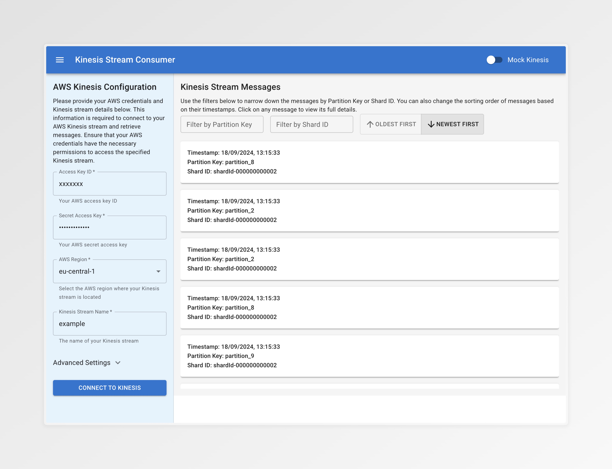
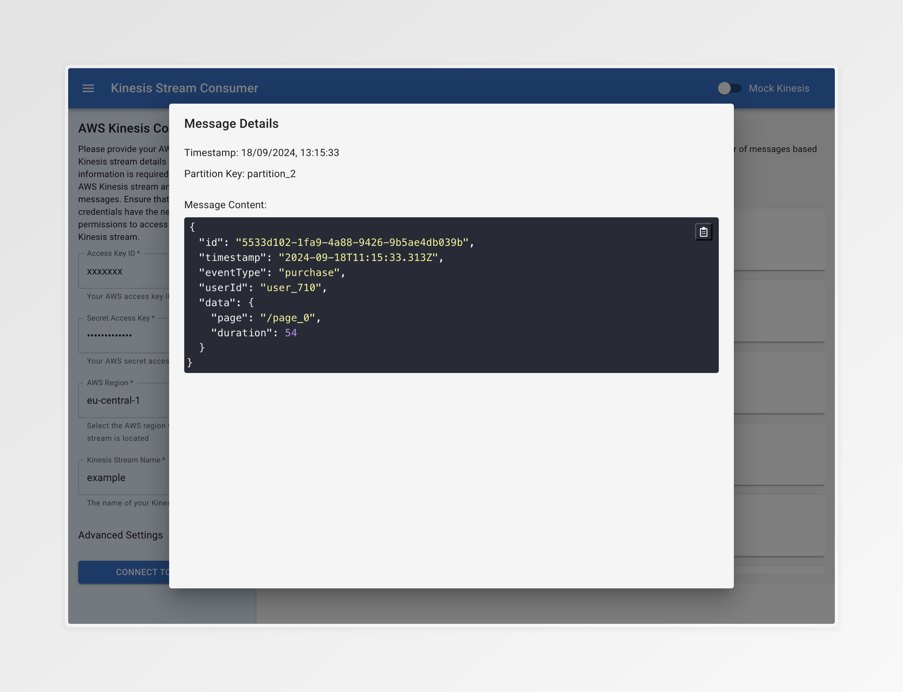

# Kinesis Stream Consumer

## Overview



Kinesis Stream Consumer is a web-based application that allows users to connect to and view messages from Amazon Kinesis streams. 
It provides a user-friendly interface for inputting AWS credentials, connecting to Kinesis streams, and displaying stream data with filtering and sorting capabilities.

## Running the Application with Docker

The preferred method to run the application is using Docker. This ensures a consistent environment and simplifies the setup process.

### Pulling the Docker Image

To pull the Docker image, run the following command:

```sh
docker pull ghcr.io/wstolk/kinesis-web-consumer:latest
```

### Running the Docker Container

To run the Docker container, use the following command:

```sh
docker run -d -p 3000:3000 --name kinesis-web-consumer ghcr.io/wstolk/kinesis-web-consumer:latest
```

This will start the application and make it available at `http://localhost:3000`.

### Stopping the Docker Container

To stop the running container, use the following command:

```sh
docker stop kinesis-web-consumer
```

### Removing the Docker Container

To remove the container, use the following command:

```sh
docker rm kinesis-web-consumer
```

### Additional Docker Commands

- **View logs**: `docker logs kinesis-web-consumer`
- **Restart the container**: `docker restart kinesis-web-consumer`

Ensure you have Docker installed on your system before running these commands. For more information on Docker, visit the [official Docker documentation](https://docs.docker.com/get-started/).

## Features

- Connect to AWS Kinesis streams using AWS credentials
- View Kinesis stream messages in real-time
- Filter messages by Partition Key and Shard ID
- Sort messages by timestamp
- View detailed message content in a modal
- Toggle between mock data and real Kinesis data in development mode
- Caching of form entries for quick reconnection



## Technologies Used

- Next.js
- React
- Material-UI
- AWS SDK for JavaScript

## Prerequisites

- Node.js (v14 or later)
- npm (v6 or later)
- An AWS account with Kinesis streams set up (for production use)

## Installation

1. Clone the repository:
   ```
   git clone https://github.com/your-username/kinesis-stream-consumer.git
   cd kinesis-stream-consumer
   ```

2. Install dependencies:
   ```
   npm install
   ```

## Running the Application

### Development Mode

Run the following command:

```
npm run dev
```

The application will be available at `http://localhost:3000`.

### Production Mode

Build the application:

```
npm run build
```

Start the production server:

```
npm start
```

## Usage

1. Open the application in your web browser.
2. Enter your AWS credentials and Kinesis stream details in the sidebar form.
3. Click "Connect to Kinesis" to fetch stream data.
4. View messages in the main panel, use filters and sorting as needed.
5. Click on a message to view its full content in a modal.

## Development Features

- Toggle between mock and real Kinesis data using the switch in the header (only visible in development mode).
- Cached form entries for quick testing and development.

## Security Considerations

- This application handles sensitive AWS credentials. Ensure proper security measures are in place when deploying to production.
- Do not commit any real AWS credentials to the repository.

## Contributing

Contributions are welcome! Please feel free to submit a Pull Request.
