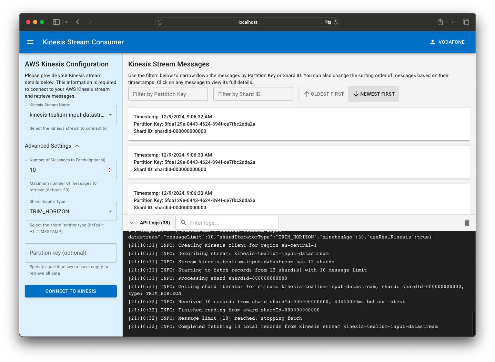
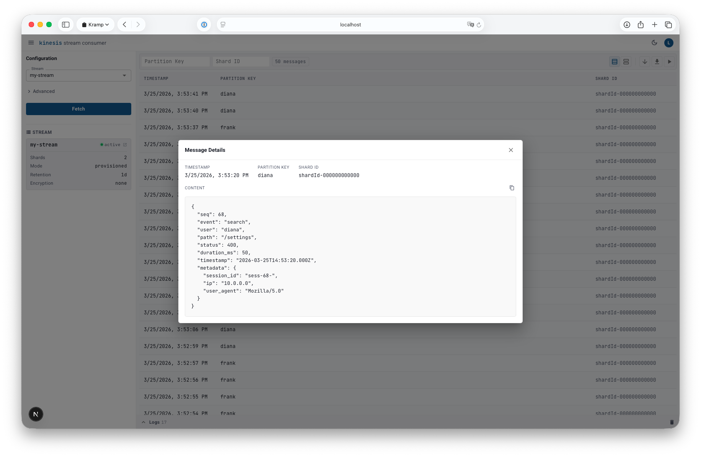
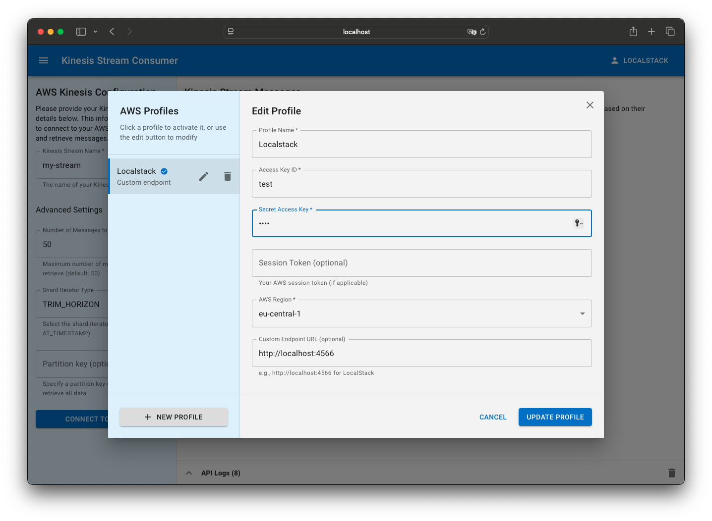

# Kinesis Web Consumer

A web-based viewer for Amazon Kinesis streams. Connect to any Kinesis stream, browse messages in real time, filter by partition key or shard, and export data as JSON -- all from your browser.

Built with Next.js, React, Material-UI, and the AWS SDK for JavaScript (v3).



---

## Table of Contents

- [Features](#features)
- [Quick Start](#quick-start)
- [Docker](#docker)
- [Authentication](#authentication)
- [Configuration](#configuration)
- [Architecture](#architecture)
- [Development](#development)
- [Security](#security)
- [Contributing](#contributing)
- [License](#license)

---

## Features

- **Multiple AWS auth methods** -- AWS profiles, default credential chain, IAM roles, or manual credentials
- **Real-time polling** -- configurable auto-refresh from 5 seconds to 5 minutes with circuit breaker protection
- **Message browsing** -- filter by partition key and shard ID, sort by timestamp, view full message detail in a modal
- **JSON export** -- download filtered messages as a JSON file
- **Mock data mode** -- develop and test without AWS credentials
- **Custom endpoints** -- connect to LocalStack or other AWS-compatible services
- **Production-ready** -- connection pooling, request throttling, deduplication, exponential backoff, memory limits
- **Docker support** -- multi-platform images (amd64/arm64) with credential mounting
- **Real-time logs** -- server-sent events log viewer built into the UI



---

## Quick Start

### Prerequisites

- **Node.js 18+** and npm
- An AWS account with at least one Kinesis stream (or use mock mode / LocalStack)

### Install and run

```bash
git clone https://github.com/wstolk/kinesis-web-consumer.git
cd kinesis-web-consumer
npm install
npm run dev
```

Open [http://localhost:3000](http://localhost:3000). The app will prompt you to authenticate on first load.

### Production build

```bash
npm run build
npm start
```

---

## Docker

### Pull the pre-built image

```bash
docker pull ghcr.io/wstolk/kinesis-web-consumer:latest
```

### Run with AWS profiles (recommended)

```bash
docker run -d -p 3000:3000 \
  -v ~/.aws:/root/.aws:ro \
  --name kinesis-web-consumer \
  ghcr.io/wstolk/kinesis-web-consumer:latest
```

### Run with a specific profile

```bash
docker run -d -p 3000:3000 \
  -v ~/.aws:/root/.aws:ro \
  -e AWS_PROFILE=my-profile \
  --name kinesis-web-consumer \
  ghcr.io/wstolk/kinesis-web-consumer:latest
```

### Run with environment variables

```bash
docker run -d -p 3000:3000 \
  -e AWS_ACCESS_KEY_ID=your_key \
  -e AWS_SECRET_ACCESS_KEY=your_secret \
  -e AWS_DEFAULT_REGION=eu-central-1 \
  --name kinesis-web-consumer \
  ghcr.io/wstolk/kinesis-web-consumer:latest
```

The application is available at `http://localhost:3000`.

### Build the image locally

```bash
docker build -t kinesis-web-consumer .
```

### Docker Compose with LocalStack

The included `docker-compose.yml` starts [LocalStack](https://localstack.cloud/) with a Kinesis stream for local development:

```bash
docker compose up -d
```

This creates a `my-stream` Kinesis stream on `localhost:4566`. In the app, use the custom endpoint field to connect to `http://localhost:4566`.

### Container management

```bash
docker logs kinesis-web-consumer      # View logs
docker restart kinesis-web-consumer   # Restart
docker stop kinesis-web-consumer      # Stop
docker rm kinesis-web-consumer        # Remove
```

---

## Authentication

The application supports three authentication methods, in order of recommendation:

### 1. AWS Profiles (recommended)

Uses your existing `~/.aws/config` and `~/.aws/credentials` files. The app auto-discovers available profiles and lets you switch between them from the header menu. No credentials are stored in the browser.



### 2. Default credential chain

Picks up credentials from environment variables (`AWS_ACCESS_KEY_ID`, `AWS_SECRET_ACCESS_KEY`, `AWS_DEFAULT_REGION`), EC2/ECS IAM roles, or any other source in the [default AWS credential provider chain](https://docs.aws.amazon.com/sdk-for-javascript/v3/developer-guide/setting-credentials-node.html). No UI configuration needed.

### 3. Manual credentials

Enter access key, secret key, and optional session token directly in the UI. Credentials are stored in browser localStorage for convenience. Use this only for development and testing.

---

## Configuration

### Environment variables

| Variable | Description | Default |
|---|---|---|
| `AWS_ACCESS_KEY_ID` | AWS access key (fallback auth) | -- |
| `AWS_SECRET_ACCESS_KEY` | AWS secret key (fallback auth) | -- |
| `AWS_DEFAULT_REGION` | Default AWS region | -- |
| `AWS_PROFILE` | AWS profile name | -- |
| `NODE_ENV` | `development` or `production` | `development` |

### Polling

Configure polling through the header controls after connecting to a stream:

| Setting | Range | Default |
|---|---|---|
| Polling interval | 5 seconds -- 5 minutes | 30 seconds |
| Messages per request | 1 -- 1,000 | 50 |
| Max messages in memory | -- | 5,000 |

The polling system includes a **circuit breaker** that automatically pauses after 3 consecutive failures, then resumes with exponential backoff.

### Shard iterator types

- **TRIM_HORIZON** -- read from the oldest available record
- **AT_TIMESTAMP** -- read from a point in time (configured via "minutes ago")

---

## Architecture

```
src/
├── components/          # React UI components
│   ├── Header.js        #   Top bar with profile switching
│   ├── Sidebar.js       #   Connection form (stream, shard config)
│   ├── MessageList.js   #   Message table with filters, sort, export
│   ├── MessageModal.js  #   Full message detail viewer
│   ├── AuthModal.js     #   Authentication dialog
│   ├── LogViewer.js     #   Real-time SSE log display
│   └── ...
├── contexts/            # React context providers
├── hooks/
│   └── usePolling.js    # Polling state and controls
├── lib/                 # Core services (singletons)
│   ├── kinesis.js       #   AWS Kinesis SDK wrapper with retry logic
│   ├── dataFetchingService.js  # Request throttling, dedup, backoff
│   ├── pollingService.js       # Polling orchestration, circuit breaker
│   ├── loggingService.js       # SSE-based logging
│   ├── awsProfiles.js          # ~/.aws/ file parser
│   └── constants.js            # App-wide configuration
└── pages/
    ├── index.js         # Main application page
    └── api/             # Backend API routes
        ├── kinesis.js   #   POST - fetch stream records
        ├── authenticate.js  # POST - validate credentials
        ├── aws-profiles.js  # GET  - list AWS profiles
        └── logs.js          # GET  - SSE log stream
```

Key design decisions:

- **Pages Router** (not App Router) with Next.js 14
- **Singleton services** in `lib/` for business logic
- **Server-side AWS operations** -- credentials never reach the browser when using profiles or default chain
- **Standalone output** for optimized Docker images

---

## Development

### Available scripts

| Command | Description |
|---|---|
| `npm run dev` | Start dev server with hot reload |
| `npm run build` | Production build |
| `npm start` | Start production server |
| `npm run lint` | Run ESLint |
| `npm run audit` | Audit production dependencies |
| `npm run audit:fix` | Auto-fix audit findings |

### Code conventions

- **Functional components** with hooks (no class components)
- **Path aliases** -- use `@/` for imports from `src/` (e.g., `import Header from '@/components/Header'`)
- **Material-UI** for all styling via the `sx` prop and centralized theme
- **Logging** -- use `loggingService.log(level, message)` instead of `console.log`
- **Error handling** -- API routes use try-catch with JSON error responses; client uses `ErrorNotification`
- **ESLint** -- extends `next/core-web-vitals`

See [CONTRIBUTING.md](CONTRIBUTING.md) for more details.

---

## Security

- AWS operations run server-side; credentials are not exposed to the browser when using profiles or default chain
- Docker images run as a non-root user (UID 1001) and are signed with cosign
- Request throttling and circuit breakers protect against runaway polling
- Credential redaction is applied in all log output

For the full security policy, vulnerability reporting instructions, and deployment best practices, see [SECURITY.md](SECURITY.md).

---

## Contributing

Contributions are welcome. See [CONTRIBUTING.md](CONTRIBUTING.md) for setup instructions, code style guidelines, and the PR process.

---

## License

This project is distributed under the MIT License. See the [LICENSE](LICENSE) file for details.
